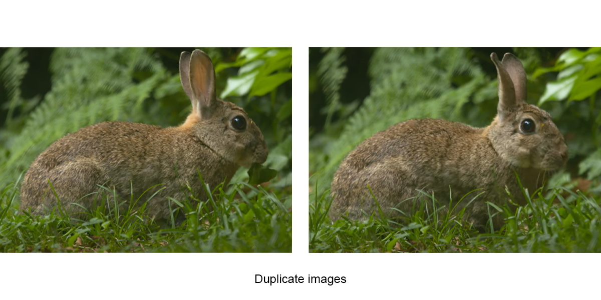
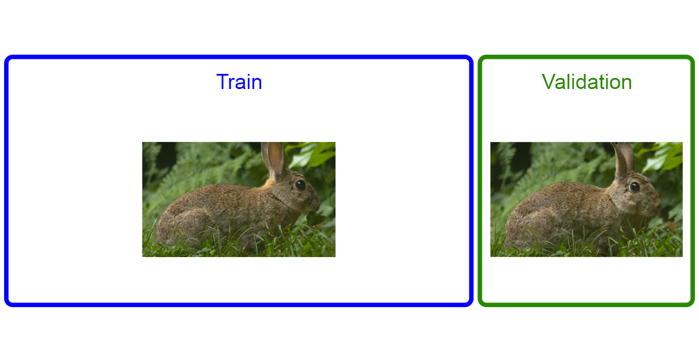
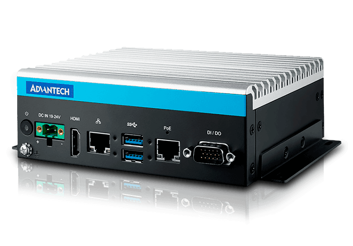

# Разработка ПО для промышленного шредера на основе ML

## 1. Состав работ
1. Создать систему сбора и хранения данных
2. Сбор данных(на каждый класс по 5к фотографий)
3. Разметка данных
4. Обучение модели
5. Инференс модели
6. Реализация взаимодействия модели с АСУ ТП
   
### 1.1 Создать систему сбора и хранения данных
Необходимо проконсультироваться с специалистом в области **data engineering**.  
По предварительным исследования данные надо хранить в [**S3**](https://blog.roboflow.com/how-to-use-s3-computer-vision-pipeline/).

либо создать однокнопочную систему сбора данных которая будет сохранять данные на жёсткий диск.

**Источник данных:**  
камера установленная на шредере смотрящая на конвейер.

**Формат данных:**  
Скрины с конвейера с запрещёнными предметами.

### 1.2 Сбор данных(на каждый класс по 5к фотографий)
Зависит от условий работы шредера.

Потоковый сбор данных неподойдёт, поскольку хранилище будет забиваться дубликатами

Из за дубликатов может получиться, так что одинаковые фото окажутся в **test** и **valid** выборках

### 1.3 Разметка данных
Для разметки данных будем использовать [**CVAT**](https://www.cvat.ai/).  
Он покрывает 90% задач в разметке.

[**CVAT. Инструкция по разметке**](https://habr.com/ru/articles/677484/)

### 1.4 Обучение модели
Для обучения детекции будем использовать сети семейства [**YOLO**](https://habr.com/ruarticles/514450/) или модели [**MMDetection**](https://github.com/open-mmlab/mmdetection).

Следует протестировать ситуации где:
1. Модель распознаёт только запрещённые предметы
2. Модель распознаёт только разрешённые предметы
3. Модель распознаёт и разрешённые и запрещённые предметы

Оценка метрик и тестирование модели.
    
### 1.5 Инференс модели
Реализация инференса модели на [**Nvidia Jetson TX2**](https://advantech.pro/news/new/promyshlennyy-kompyuter-mic-720ai-dlya-prilozheniy-ii-na-baze-nvidia-jetson-tx2-v-kompaktnom-ispolne/) 

Полезные статьи:
1. [TensorRT Экспорт для моделей YOLOv8](https://docs.ultralytics.com/ru/integrations/tensorrt/)
2. [Развертывание на NVIDIA Jetson с помощью TensorRT и DeepStream SDK](https://docs.ultralytics.com/ru/yolov5/tutorials/running_on_jetson_nano/)

### 1.6 Реализация взаимодействия модели с АСУ ТП
...

